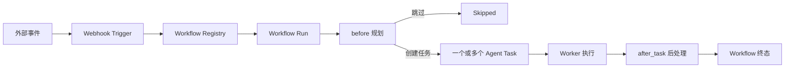
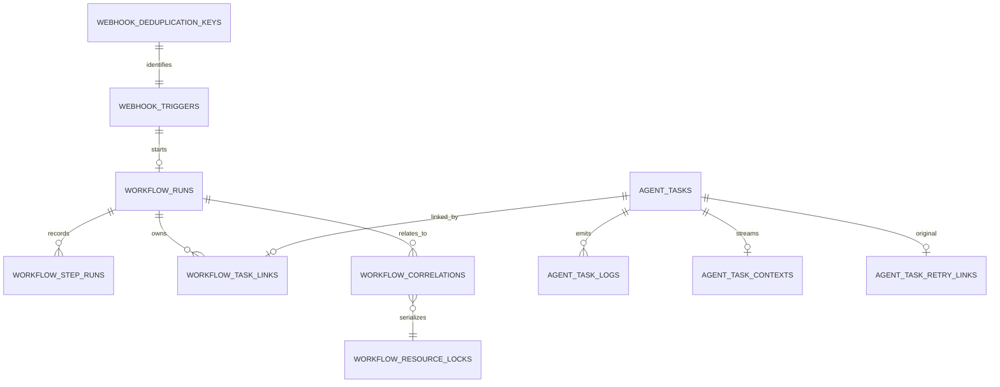
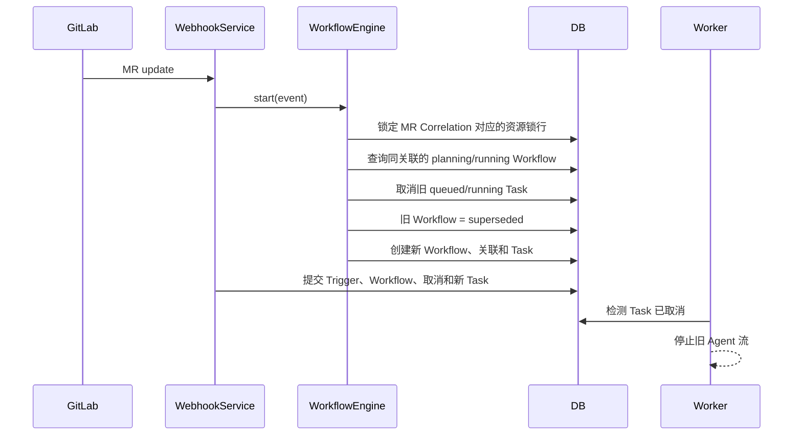

# Workflow 与数据库概念

本文说明当前项目中 Webhook、Workflow、Task 和数据库记录之间的关系，以及扩展新工作流时需要遵守的约定。

## 1. 核心模型

系统把一次外部事件拆成四层概念：

1. **Webhook Trigger**：服务实际收到的一次外部投递，保留原始 Payload 和平台投递标识。
2. **Workflow Run**：系统针对该事件做出的一次业务决策，例如跳过、创建检视任务或替换旧分析。
3. **Workflow Step Run**：一次工作流中的可审计步骤，例如 `before`、`after_task:<task_id>`、Retry 或 Supersede。
4. **Agent Task**：最终由 Worker 执行的 Agent 调用，有独立的队列、状态、重试次数、上下文和结果。

一个事件只会选择一个 Workflow。Workflow 可以创建零个、一个或多个 Task，因此需要更新代码图谱和知识库时，应由同一个 Workflow 规划两个不同 `role` 的 Task，而不是期望注册表把事件依次交给多个 Workflow。



### 为什么使用 Workflow

当前架构中几个相近概念的边界如下：

- **Webhook** 是传输入口，负责验签、解析外部事件和幂等；
- **Workflow** 是业务编排层，负责“是否执行、执行哪些 Task、旧任务是否失效、完成后做什么”；
- **`before/after_task`** 是 Workflow 内的生命周期扩展点；
- **Task Queue** 是异步执行边界，负责领取、超时、自动重试和 Agent 调用；
- **数据库** 是持久化状态机，让重启恢复、审计、Retry 和 Supersede 不依赖进程内状态；
- **HTTP Middleware** 只适合鉴权、日志、Trace 等横切逻辑，不适合承载 MR、Issue 等业务规则。

当前系统没有引入独立事件总线。只有在一个业务事件需要由多个可独立部署、允许最终一致的消费者分别处理时，才值得再增加 Event Bus；现阶段一个 Workflow 创建多个 Task 更直接，也能维持清晰的事务边界。

## 2. Workflow 代码对象

### `WorkflowEvent`

`WorkflowEvent` 是工作流的统一输入：

| 字段 | 含义 |
| --- | --- |
| `provider` | 事件来源，例如 `gitlab`、`github` |
| `event_type` | 平台 Header 中的事件类型，例如 `Merge Request Hook`、`pull_request` |
| `payload` | 原始事件 Payload |
| `event_uuid` | 事件标识，用于追踪 |
| `webhook_uuid` | Webhook 投递标识，用于幂等去重 |
| `instance_url` | GitLab、GitHub 或 GitHub Enterprise Server 实例地址 |
| `config` | 本次运行配置，例如 Prompt 模板路径、目标队列 |

事件、配置和工作流上下文分别持久化到 `workflow_runs.payload`、`config` 和 `context`，任务完成后仍可重建 `after_task` 所需的输入。

### `WorkflowRegistry`

注册表按 `priority` 从高到低检查 `matches(event)`，第一个匹配项获胜。`name + version` 必须唯一。

当前 `GitLabPromptTaskWorkflow` 和 `GitHubPromptTaskWorkflow` 的优先级都是 `-1000`，分别是
各平台事件的兜底工作流。两者复用 `WebhookPromptTaskWorkflow` 的模板渲染和任务元数据逻辑。
新增更具体的工作流使用默认优先级 `0` 或更高值，即可在平台兜底工作流之前匹配。

### `before()` 与 `WorkflowPlan`

`before()` 负责前处理与规划，返回一个 `WorkflowPlan`：

- `tasks`：需要创建的 Task 声明；
- `skip_reason`：不应创建任务时的明确原因；
- `context`：跨步骤保存的工作流状态；
- `correlations`：本次运行关联的业务资源；
- `supersede_correlations`：本次运行要替换的旧分析范围。

Plan 必须选择“创建至少一个 Task”或“明确跳过”之一。`before()` 中应尽量只做计算、校验和只读操作；需要与任务创建保持一致的数据库写入，由 Engine 根据 Plan 统一完成。

### `WorkflowTaskSpec`

每个 Task Spec 描述 Prompt、模型、队列、优先级、Agent 参数和 `role`。`role` 表示任务在工作流中的职责，例如：

```python
return WorkflowPlan.create_tasks(
    WorkflowTaskSpec(prompt="更新代码图谱", role="code_graph"),
    WorkflowTaskSpec(prompt="更新知识库", role="knowledge_base"),
    context={"source": "merge"},
)
```

### `after_task()`

Task 进入终态后，Engine 调用工作流的 `after_task(event, outcome, context)`。返回的 `WorkflowPostResult.context_updates` 会合并进持久化上下文。

Engine 使用 `after_task:<task_id>` 步骤记录避免对同一终态重复执行后处理。所有当前有效的关联 Task 都结束后：

- 全部 `succeeded`：Workflow 进入 `succeeded`；
- 任一 Task 是其他终态：Workflow 进入 `failed`；
- 仍有 `queued` 或 `running`：Workflow 保持 `running`。

## 3. 数据库关系



### `webhook_triggers`

保存收到的 Webhook 档案。`payload` 是原始 Payload；`task_id` 是兼容单任务 Webhook 的快捷引用。多任务工作流应以 `workflow_task_links` 为权威关联来源。

### `webhook_deduplication_keys`

使用 `provider + webhook_uuid` 作为主键，并唯一指向一个 Trigger。重复投递直接返回已有 Trigger、Workflow 和 Task，不会再次规划任务。

### `workflow_runs`

表示一次 Workflow 执行：

- `workflow_name + workflow_version` 标识执行定义；
- `payload/config/context` 保存可恢复的 JSON 数据；
- `webhook_trigger_id` 唯一关联触发记录；
- `skip_reason` 与 `error_message` 分别记录业务跳过和执行错误；
- `created_at/updated_at/finished_at` 使用 UTC 时间。

### `workflow_step_runs`

保存步骤输入、输出、错误和耗时。当前常见步骤名：

| 步骤名 | 含义 |
| --- | --- |
| `before` | 前处理和任务规划 |
| `after_task:<task_id>` | Task 终态后处理 |
| `retry_task:<new_task_id>` | 手动 Retry 替换任务 |
| `superseded_by:<workflow_run_id>` | 被更新事件替换 |

### `workflow_task_links`

连接 Workflow 与 Task：

- `role`：任务职责；
- `ordinal`：创建顺序；
- `is_active`：该 Task 是否仍是本 Workflow 中当前有效的尝试。

一个 Task 最多关联一个 Workflow。手动 Retry 不会复用旧 Task，而是把旧 Link 设为 `is_active=false`，创建新 Task 和 Link，并保留原来的 `role/ordinal`。

`agent_task_retry_links` 记录原 Task 到新 Task 的替换关系，并以原 Task ID 为主键。对同一个原 Task 重复或并发 Retry 时，只有第一个请求可以创建替代任务，其他请求返回冲突。

### `workflow_correlations`

把 Workflow Run 映射到外部业务资源。当前关联键由以下字段组成：

```text
provider + resource_type + project_path + resource_id
```

GitLab Merge Request 的映射示例：

```text
gitlab + merge_request + group/project + 123
```

GitHub Pull Request 使用同样的业务键结构：

```text
github + pull_request + octo-org/octo-repo + 123
```

表上有同字段顺序的组合索引，用于快速查询同一 MR 的历史 Workflow 和 Task；同一 Run 的重复关联由唯一约束阻止。未来可以使用相同机制关联 Issue、Commit 或 Pipeline。

### `workflow_resource_locks`

为每个 Correlation Key 保存一条持久化锁记录。同一个 MR 的 Workflow 规划会锁定同一行，直到 Webhook 事务提交；不同 MR 使用不同锁行，仍可并发执行。多个关联键按稳定顺序加锁，避免工作流同时关联多个资源时产生锁顺序死锁。

PostgreSQL/MySQL 使用 `SELECT ... FOR UPDATE` 行锁。SQLite 不支持行级 `FOR UPDATE`，创建 Workflow 时由其单写事务串行化；终态处理和队列维护在读取状态前使用 `BEGIN IMMEDIATE` 获取写事务。

### Task 相关表

- `agent_tasks`：任务输入、队列策略、运行状态、结果与超时信息；
- `agent_task_logs`：按时间追加的状态和诊断事件；
- `agent_task_contexts`：Agent 流式消息的最新完整列表。

## 4. 状态模型

### Task 状态

| 状态 | 含义 |
| --- | --- |
| `queued` | 等待 Worker 领取 |
| `running` | Worker 已领取并正在执行 |
| `succeeded` | 成功完成并写入结果 |
| `failed` | 已耗尽自动重试次数 |
| `cancelled` | 用户或 Workflow 主动取消 |
| `abandoned` | 队列超时、运行超时、服务关闭或启动恢复时中止 |

自动重试是同一 Task 从 `running` 回到 `queued`；它被 Worker 再次领取时增加 `attempt`。手动 Retry 会在一个事务中创建全新的 Task、写入 Retry Link、替换 Workflow Link 并重开 Workflow。

### Workflow Run 状态

| 状态 | 含义 |
| --- | --- |
| `planning` | 正在执行 `before` 规划 |
| `running` | 已创建 Task，等待所有有效 Task 结束 |
| `skipped` | 前处理决定不创建 Task |
| `succeeded` | 所有有效 Task 成功且后处理完成 |
| `failed` | 规划、后处理失败，或任一有效 Task 以非成功终态结束 |
| `superseded` | 被同一业务资源的更新事件替换 |

`skipped` 和 `superseded` 不会因 Task 的迟到回调重新打开。对可 Retry 的旧 Workflow，手动 Retry 会把状态重新设为 `running`。

### Step 状态

Step 使用 `running`、`skipped`、`succeeded`、`failed`，描述单个步骤，而不是整个 Workflow 的结论。

## 5. PR 更新的替换机制

GitLab MR Payload 满足以下条件时会建立关联：

```text
object_kind == "merge_request"
project.path_with_namespace 存在
object_attributes.iid 存在
```

GitHub `pull_request` Payload 在 `repository.full_name` 与 PR `number` 存在时建立关联；
`action == "synchronize"` 与 GitLab 的 `object_attributes.action == "update"` 一样，会替换同一 PR
尚未完成的旧工作流。

当 `object_attributes.action == "update"` 时，当前 Plan 同时声明该关联为 `supersede_correlations`。



替换规则：

- 只处理相同 `provider/resource_type/project_path/resource_id` 的旧 Workflow；
- 只替换 `planning/running` 的旧 Workflow；
- 只取消旧 Workflow 中 `is_active=true` 且为 `queued/running` 的 Task；
- 已经完成的 Workflow 和 Task 保持历史状态；
- 旧 Workflow 的 `context.superseded_by_workflow_run_id` 指向新 Run；
- Supersede 步骤记录被取消的 Task ID。

运行中的 Agent 通过数据库状态进行协作取消：收到下一条 SDK 流消息时检测到 `cancelled` 并退出。即使取消与任务完成同时发生，成功/失败回写前也会重新读取数据库状态，避免迟到结果覆盖 `cancelled`。

## 6. 事务与一致性

`SessionLocal` 关闭了 `autoflush`，Engine 在需要主键或外键时显式 `flush`。正常 Webhook 的以下写入由 `WebhookService` 在一个事务中提交：

- Workflow Run 和 `before` Step；
- Correlation；
- 被替换的旧 Workflow 与 Task 取消记录；
- 新 Agent Task、Task Log 和 Workflow Link；
- Webhook Trigger 与幂等键。

因此，新任务创建失败时，旧任务取消也会一起回滚。规划异常是特殊情况：Engine 会回滚上述事务，再单独保存一个 `failed` Workflow Run 和失败的 `before` Step，便于诊断；此时不会产生 Webhook Trigger 或 Agent Task。

Task 执行发生在后续 Worker 事务中。Task 终态和 Workflow `after_task` 分开提交，因此启动恢复和周期维护会调用 `reconcile_terminal_tasks()`，补齐已经终态但尚未处理的 Workflow。

### 并发写入规则

系统只串行化会修改相同业务状态的操作，不会锁住无关 Webhook：

| 共享范围 | 并发控制 |
| --- | --- |
| 不同 Correlation Key | 不共享业务锁，可并发 |
| 同一 MR 的 Start/Supersede | `workflow_resource_locks` 行锁 |
| 同一 Workflow 的多个 Terminal 回调 | 锁定对应 `workflow_runs` 行 |
| Task 状态变化 | `UPDATE ... WHERE status = <expected>` 条件更新 |
| 同一原 Task 的 Retry | 原 Task 行锁和 `agent_task_retry_links` 主键 |

Task 的成功、自动重试、最终失败、取消和 Abandon 都只有在数据库状态仍符合预期时才能更新。竞争失败的一方不会写日志或覆盖先完成的终态。例如 Worker 成功和 Cancel 同时发生时，最终只保留一个状态及一条对应的终态日志。

同一 Workflow 的 Terminal 回调取得行锁后，才检查已有 Step、执行 `after_task`、合并 Context 并计算整体状态。因此多个 Task 同时完成时会依次合并，不会互相覆盖，也不会因为双方看不到对方 Step 而永久停留在 `running`。

## 7. 数据库初始化与变更

应用启动时执行：

```python
Base.metadata.create_all(bind=engine)
```

它会创建缺失的表及这些新表声明的索引，但不会为已有表修改列、约束或索引。当前仓库没有 Alembic，因此：

- 新增独立表可以由 `create_all` 创建；
- 修改现有列、重命名字段或删除结构时，必须同时准备显式迁移方案；
- 生产数据库变更前应备份，并先在同数据库类型的测试环境验证；
- 不要依赖删除本地 SQLite 文件来模拟生产升级。

数据库连接由 `DATABASE_URL` 配置，`POSTGRES_EXTERNAL_URL` 非空时优先使用外部 Postgres URL。SQLite 会额外设置 `check_same_thread=false`；连接池启用了 `pool_pre_ping`。

## 8. 新增工作流

推荐步骤：

1. 在 `src/cc_fastapi/workflows/` 新建 Workflow 类；
2. 实现稳定且足够精确的 `matches()`；
3. 在 `before()` 中返回 Task 或 Skip Plan；
4. 需要聚合结果或触发后续行为时实现 `after_task()`；
5. 在 `build_default_workflow_engine()` 中注册；
6. 为匹配优先级、跳过、任务数量、终态、Retry 和 Correlation 编写测试。

示例：

```python
class MergeKnowledgeWorkflow(Workflow):
    name = "merge_knowledge"
    version = "1"
    priority = 100

    def matches(self, event: WorkflowEvent) -> bool:
        parsed = event.webhook_payload
        change_request = parsed.change_request if parsed else None
        return (
            event.provider == "gitlab"
            and change_request is not None
            and change_request.resource_type == "merge_request"
            and change_request.action == "merge"
        )

    def before(self, event: WorkflowEvent) -> WorkflowPlan:
        return WorkflowPlan.create_tasks(
            WorkflowTaskSpec(prompt="更新代码图谱", role="code_graph"),
            WorkflowTaskSpec(prompt="更新知识库", role="knowledge_base"),
            context={"source": "gitlab_merge"},
        )
```

如果该工作流也需要按 MR 检索，应创建 `WorkflowCorrelationSpec` 并传入 `correlations`。如果新事件应替换旧分析，再把同一个 Spec 同时传入 `supersede_correlations`。

## 9. 查询关联的 MR Task

内部 API 使用 Correlation 索引连接 Workflow、Task、上下文和 Webhook：

```http
GET /v1/internal/gitlab/merge-request-tasks?project_path=group/project&merge_request_iid=123&offset=0&limit=200
X-API-Token: <API_TOKEN>
```

返回内容包括 Task Payload、Prompt、模型、Metadata、结果、流式上下文、时间、Workflow 状态、`role/is_active` 和 Webhook 标识。接口最大 `limit` 为 500；配置了 `API_TOKEN` 时必须提供一致的 `X-API-Token`。

常见判断方式：

- 最新有效分析：按返回顺序取第一个 `workflow_status=running/succeeded` 且 Task 未取消的记录；
- 被更新替换的历史：`workflow_status=superseded`；
- 手动 Retry 历史：同一 Workflow 中旧 Link 为 `is_active=false`，新 Link 为 `true`；
- 业务跳过：此类运行没有关联 Task，不会出现在本接口中；应通过 Webhook 档案查看 Workflow 的 `skip_reason`。

## 10. 代码入口

| 位置 | 职责 |
| --- | --- |
| `workflows/base.py` | Workflow 接口和 Plan 数据结构 |
| `workflows/registry.py` | 优先级匹配和版本查找 |
| `workflows/engine.py` | 持久化、任务编排、后处理、Retry、Supersede |
| `workflows/gitlab_prompt.py` | 默认 GitLab Prompt 工作流和 MR 关联提取 |
| `workflows/github_prompt.py` | 默认 GitHub Prompt 工作流和 PR 关联提取 |
| `workflows/prompt_task.py` | 多平台 Prompt 模板渲染与任务规划公共层 |
| `services/webhooks.py` | Webhook 幂等、事务提交和兼容旧记录 |
| `services/queue.py` | Task 状态机、队列领取、取消和自动重试 |
| `services/worker.py` | Agent 执行、协作取消和终态回调 |
| `db/models.py` | SQLAlchemy 表结构和状态枚举 |
| `api/internal.py` | 按 GitLab MR 查询关联 Task |
